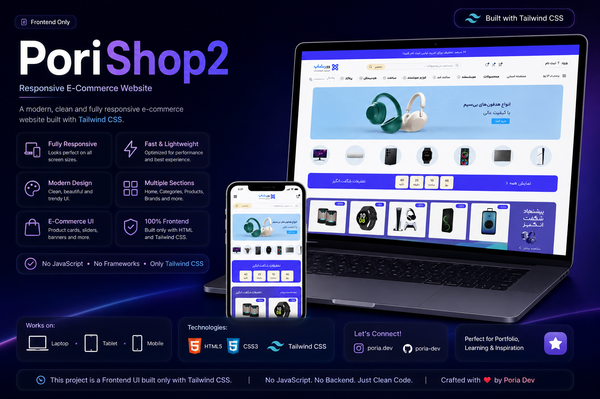

<div align="center">

# 🛍️ PoriShop2

### Modern Responsive E-Commerce Landing Page

Built with **HTML5** & **Tailwind CSS**


Live Demo 👇

### 🌐 https://poria-dev.github.io/tailwind_responsive_PoriShop2/



</div>

---

## ✨ Overview

PoriShop2 is a modern and responsive e-commerce landing page designed with a clean UI and premium user experience.

The project focuses on responsive layouts, reusable UI sections and professional design without using any JavaScript or external frameworks.

---

# 🚀 Features

- 💎 Modern UI Design
- 📱 Fully Responsive
- 🛒 E-Commerce Landing Page
- 🎯 Pixel Perfect Layout
- ⚡ Fast & Lightweight
- 🎨 Built only with Tailwind CSS
- 🖥 Desktop / Tablet / Mobile Support
- 📦 Reusable Components
- 🌈 Smooth Hover Effects
- ❤️ Clean Code Structure

---

# 🛠 Built With

<p align="center">


</p>

---

# 📱 Responsive Preview

| Desktop | Tablet | Mobile |
|---------|--------|--------|
| ✅ | ✅ | ✅ |

---

# 📸 Project Showcase


---

# 📂 Folder Structure

```text
PoriShop2/
│
├── assets/
│   ├── images/
│   ├── icons/
│   └── ORG.png
│
├── index.html
└── README.md
```

---

# 🌐 Live Demo

### https://poria-dev.github.io/tailwind_responsive_PoriShop2/

---

# 💻 Clone Project

```bash
git clone https://github.com/poria-dev/tailwind_responsive_PoriShop2.git
```

---

# 👨‍💻 Author

### Poria Rezaee

GitHub

https://github.com/poria-dev

---

<div align="center">

### ⭐ If you like this project, don't forget to leave a Star.

Made with ❤️ using Tailwind CSS

</div>
